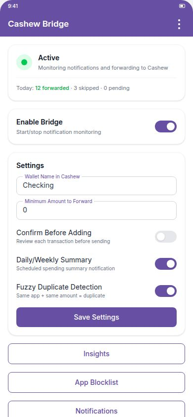
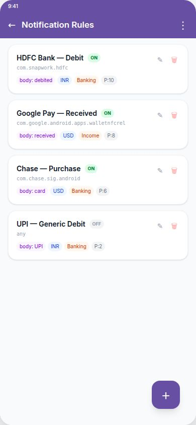
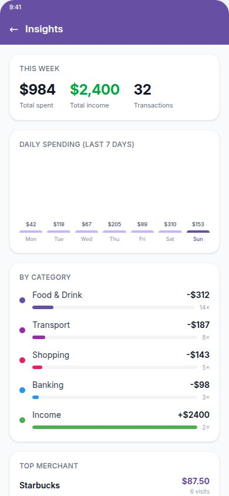
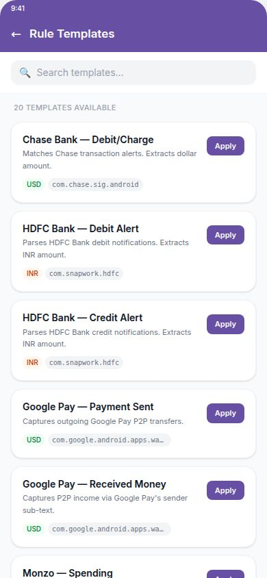
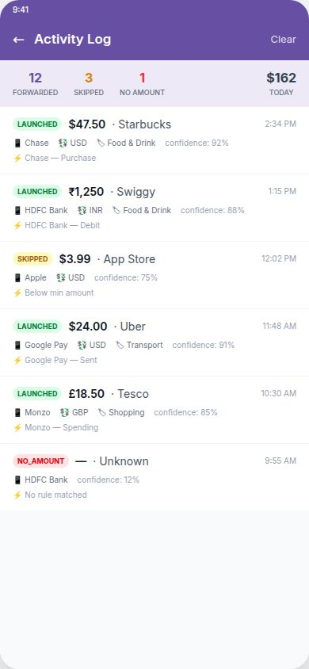

# Cashew Bridge

A native Android app that privately monitors your bank and payment notifications and automatically creates transactions in the [Cashew](https://cashewapp.web.app/) finance app — without ever granting Cashew direct notification access. All processing happens on-device with no internet permission.

## Screenshots

| Home | Rules | Insights | Templates | Activity Log |
|:---:|:---:|:---:|:---:|:---:|
|  |  |  |  |  |

---

## How It Works

```
Bank App → Notification → Cashew Bridge → cashewapp://addTransaction
```

1. **Cashew Bridge** receives notifications from your bank/payment apps via Android's `NotificationListenerService`
2. It parses the text to extract amount, merchant, currency, memo, and transaction type
3. It fires a `cashewapp://addTransaction` deep link, opening Cashew with the transaction pre-filled
4. Your data **never leaves your device** — no internet permission is declared in the manifest

---

## Building the App

### Requirements
- Android Studio Iguana (2023.2) or newer
- Android SDK 26+ (minSdk 26, targetSdk 34)
- Java 17 / Kotlin 1.9+

### Build from Android Studio
1. Clone this repository and open the `cashew-notif-bridge` folder
2. Let Gradle sync complete
3. Run on a real device (`Run > Run 'app'`) — a physical device is required to receive live notifications

### Build APK from command line
```bash
./gradlew assembleDebug
# Output: app/build/outputs/apk/debug/app-debug.apk
```

---

## Device Setup

1. Install the APK on your Android device
2. Open **Cashew Bridge** and tap **Grant Notification Access**
3. Enable **Cashew Bridge** in the system notification listener list
4. Return to the app — the status card should show **Active**
5. *(Optional)* Add rules, import templates, or configure settings

---

## Features

### Core Forwarding
- Intercepts notifications from any app you choose
- Fires `cashewapp://addTransaction` to create transactions directly in Cashew
- Heuristic fallback parsing when no custom rule matches

### Multi-Currency Detection
Automatically identifies the currency from the notification text before any regex runs. Supported symbols/codes:

| Currency | Symbols/Keywords |
|---|---|
| USD | `$`, `USD` |
| INR | `₹`, `INR`, `Rs.`, `Rs` |
| GBP | `£`, `GBP` |
| EUR | `€`, `EUR` |
| AED | `AED`, `Dhs` |
| SGD | `S$`, `SGD` |
| AUD | `A$`, `AUD` |
| CAD | `C$`, `CAD` |
| JPY | `¥`, `JPY` |

A per-rule **Currency Override** field lets you pin a specific currency regardless of what's detected.

### Confidence Scoring
The parser assigns every parsed transaction a confidence score (0–100) based on how many signals were found (regex match, currency symbol, income/expense keyword, merchant). Logged alongside every transaction.

### Notification Rules
Rules give you precise control over how individual apps are handled. Rules are evaluated in priority order (highest first); the first match wins.

**Per-rule conditions:**
| Field | Description |
|---|---|
| App Package | Match a specific app (e.g. `com.chase.sig.android`) |
| Title Contains | Substring match on notification title |
| Body Contains | Substring match on notification body |
| Sender Contains | Match the sender sub-text (useful for P2P apps that show the sender's name) |
| Condition Logic | **ALL (AND)** — all active conditions must match; **ANY (OR)** — any one match is enough |
| Active Hours | Ignore notifications outside a start/end hour range |
| Active Days | Restrict to specific days of the week |
| Min/Max Amount | Skip transactions outside an amount range |
| Per-Rule Cooldown | Suppress repeated triggers for N minutes |

**Per-rule extraction & output:**
| Field | Description |
|---|---|
| Amount Regex | Capture group 1 = amount value |
| Merchant Regex | Capture group 1 = merchant/title for Cashew |
| Memo/Ref Regex | Capture group 1 → Cashew note field (e.g. UPI UTR number) |
| Currency Override | Pin a currency (e.g. `INR`) — blank = auto-detect |
| Default Category | Cashew category name |
| Wallet Name | Cashew wallet name override |
| Mark as Income | Fixed income/expense flag (used when auto-detect is off) |
| Auto-detect Type | Use keyword heuristics instead of the fixed toggle |
| Priority | Higher = evaluated first |

### Rule Templates
Tap **Browse Templates** in the Rules screen to instantly apply a pre-built rule for 20 common bank and payment apps:

Chase, Wells Fargo, Bank of America, HDFC (debit + credit), ICICI, SBI, Monzo, Revolut, Barclays, Google Pay (sent + received), PayPal (sent + received), Venmo, Cash App (sent + received), Apple Pay, UPI generic (debit + credit).

### Inline Rule Tester
Every rule has a **Test Your Regex** section — paste sample notification text and see exactly what amount, merchant, currency, and income/expense type would be extracted before saving.

### Confirm Before Adding
When enabled, each matched notification shows an actionable notification with **Send to Cashew** / **Skip** buttons instead of firing immediately.

### Undo Send
A 10-second countdown notification appears before forwarding. Tap **Undo** to cancel or **Send Now** to skip the wait.

### Fuzzy Duplicate Detection
Beyond exact-match deduplication, fuzzy mode treats notifications from the same app with the same amount (within a configurable time window) as duplicates, even if the notification text differs slightly.

### Large Transaction Alert
Set a threshold — any transaction above it triggers a loud alarm-style notification.

### Auto-Dismiss Source Notification
After forwarding, Cashew Bridge can automatically dismiss the original bank notification from your shade.

### Batch Review Mode
Collect transactions for a configurable window (e.g. 30 minutes), then review and send them all at once from a dedicated screen.

### Unreviewed Transaction Reminders
Periodic reminder notifications if transactions are sitting unreviewed in the app.

### Privacy Mode
When Confirm mode is on, privacy mode hides the actual amount on the lock screen — shows only "Transaction detected" instead.

### Daily / Weekly Spending Summary
Enable a scheduled notification that arrives at a configurable time each day (or once a week) summarising your total spending, number of transactions, and top categories.

### Spending Insights
Tap **Insights** from the home screen to see:
- Bar chart of daily spending for the past 7 days
- Category breakdown (amount + count)
- Top merchant and period totals

### Home Screen Widget
A 2×1 widget shows today's forwarded transaction count and a toggle to enable/disable the bridge without opening the app.

### App Blocklist
Block entire apps from ever triggering the bridge, without deleting their rules — useful for temporarily silencing an app.

### Tasker Integration
Every forwarded transaction broadcasts `com.cashewbridge.app.TRANSACTION_FORWARDED` with these extras:

| Extra | Type | Description |
|---|---|---|
| `amount` | Double | Parsed amount |
| `merchant` | String | Parsed merchant/title |
| `category` | String | Category name |
| `isIncome` | Boolean | Income or expense |
| `currency` | String | Detected or overridden currency code |
| `sourcePackage` | String | Package of the originating app |

### Quick Settings Tile
Add the **Cashew Bridge** tile to your Quick Settings panel to toggle the service on/off without opening the app.

### Activity Log
Full history of every notification processed: status (LAUNCHED / SKIPPED / NO_AMOUNT / BLOCKED), matched rule, amount, merchant, currency, confidence, and raw notification text.

### Theme Support
Auto / Light / Dark mode — follows system setting by default.

### Battery Optimization Warning
The app detects if Android battery optimization is active and prompts you to exempt it, preventing missed notifications.

---

## Global Settings Reference

| Setting | Description |
|---|---|
| Default Wallet Name | Cashew wallet for all transactions (blank = Cashew default) |
| Minimum Amount | Global floor — ignore notifications below this amount |
| Duplicate Skip Window | Seconds to suppress identical notifications (exact match) |
| Confirm Before Adding | Review each transaction before it goes to Cashew |
| Auto-Dismiss Source | Remove the original notification after forwarding |
| Undo Send | 10-second cancel window before forwarding |
| Privacy Mode | Hide amounts on lock screen in Confirm mode |
| Large Transaction Threshold | Loud alert for amounts above this value (0 = off) |
| Batch Mode | Collect then review transactions in bulk |
| Batch Window | How long to collect before prompting review (minutes) |
| Reminders | Nudge if transactions sit unreviewed |
| Reminder Interval | How often to remind (minutes, min 5) |
| Daily/Weekly Summary | Scheduled spending summary notification |
| Summary Time | Hour of day to send the summary (0–23) |
| Summary Frequency | Daily or Weekly |
| Fuzzy Dedup | Treat same app + same amount as duplicate |

---

## Common Package Names

| App | Package |
|---|---|
| Google Pay | `com.google.android.apps.walletnfcrel` |
| PhonePe | `com.phonepe.app` |
| Paytm | `net.one97.paytm` |
| HDFC Bank | `com.snapwork.hdfc` |
| Chase | `com.chase.sig.android` |
| Bank of America | `com.infonow.bofa` |
| Wells Fargo | `com.wf.wellsfargomobile` |
| Barclays | `com.barclays.android.barclaysmobilebanking` |
| Monzo | `co.monzo.avant` |
| Revolut | `com.revolut.revolut` |
| PayPal | `com.paypal.android.p2pmobile` |
| Venmo | `com.venmo` |
| Cash App | `com.squareup.cash` |

> **Tip:** To find any app's package name go to Settings → Apps → [App] → Advanced, or use a free "Package Name Viewer" app.

---

## Cashew App Link Format

```
cashewapp://addTransaction
  ?amount=50.00
  &title=Starbucks
  &categoryName=Food%20%26%20Drink
  &walletName=Checking
  &income=false
  &note=UTR123456789012
  &updateData=true
```

Full documentation: [cashewapp.web.app/faq.html#app-links](https://cashewapp.web.app/faq.html#app-links)

---

## Database

Room database, private to the app, never transmitted anywhere. Schema version: **4**.

| Table | Purpose |
|---|---|
| `notification_rules` | User-defined parsing rules |
| `processed_log` | Full history of every notification processed |
| `cached_notifications` | Notifications waiting for user review |
| `batched_transactions` | Transactions held for batch review |
| `app_blocklist` | Apps blocked from triggering the bridge |

---

## Privacy

- **No `INTERNET` permission** — the manifest does not declare it; the OS blocks all network access
- All parsing and storage happens entirely on-device
- The local database is sandboxed to the app and inaccessible to other apps
- Logs can be cleared at any time from the Activity Log screen
- Confirm / Privacy Mode keeps sensitive amounts off the lock screen

---

## Architecture

```
NotificationListenerService
    └── NotificationParser          (regex + heuristics + currency + confidence)
        └── CashewLinkBuilder       (constructs cashewapp:// URI)
            └── startActivity()     (hands off to Cashew)

Supporting components:
    AppDatabase (Room v4)           Models, DAOs, migrations
    AppPreferences                  SharedPreferences wrapper
    NotificationHelper              Channel management + notification builders
    SummaryReceiver                 Daily/weekly alarm → summary notification
    BridgeWidget                    AppWidgetProvider for home screen widget
    InsightsActivity                Bar chart + category breakdown
    AppBlocklistActivity            Per-app block management
    TemplatesDialogFragment         20 pre-built rule templates
    RuleEditDialogFragment          Rule editor with inline regex tester
    RulesActivity                   Rule list with export/import/templates
    QuickToggleTileService          Quick Settings tile
```
